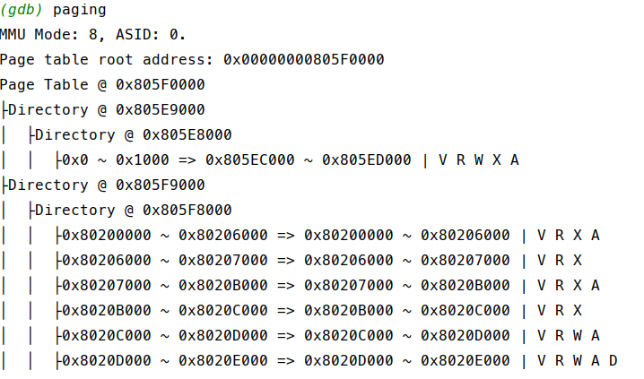
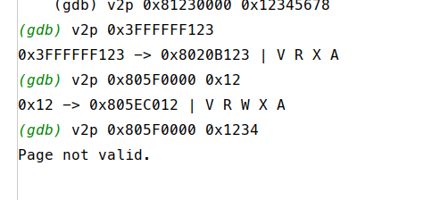

# RISCV-GDB-Paging
**SV39** Paging Debug tool for GDB using python and guile

Reference: [riscv-privileged-v1.10.pdf](https://riscv.org/wp-content/uploads/2017/05/riscv-privileged-v1.10.pdf)

## Usage:
Place `paging_debug.py` or all the `.scm` files inside your project root.

Inside gdb console:

```(gdb) so paging_debug.py```

or

```(gdb) so paging_debug.scm```

Then you can type `help paging` or `help v2p` to show the help message.

If you have any question, please search for `GDB Extension`.

> Note: I have no SV48 codes and emulator, so `SV48.scm` is not tested.

### Paging Table Inspector
```
> (gdb) help paging
 
RISC-V SV39 MMU Paging Debugging tool.
Usage: 
    paging           : The shortcut of `paging satp` 
    paging satp      : Show page table from satp register.
    paging addr      : Show page table at addr.
Example:
    (gdb) paging
    (gdb) paging satp
    (gdb) paging 0x12340000
```

### Virtual Address To Physical Address
```
(gdb) help v2p

RISC-V SV39 MMU Paging Debugging tool.
Usage: 
    v2p add          : Get Physical address of a virtual address from pagetable at satp.
    v2p pg_addr addr : Get Physical address of a virtual address from pagetable at pg_addr.
Example:
    (gdb) v2p 0x12345678
    (gdb) v2p 0x81230000 0x12345678

```

## Example

paging:



v2p:




## Todo

After finished oscomp (or a debug routine is hard for me), I may implement features list below:

1. Processes debug for custom os (flexible via user defines debug symbol, like FreeRTOS GDB).
2. Ecall tracing
3. named bitfield for register
